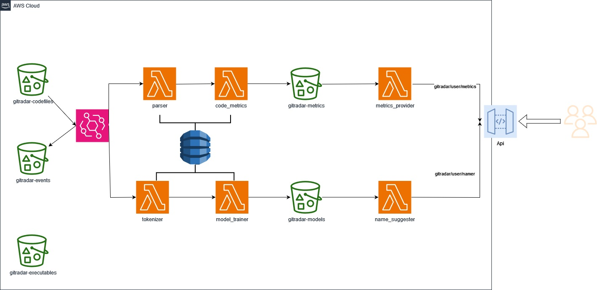

# Gitradar

## Introduction

Welcome to the GitRadar project repository! This project leverages Docker containers to build a robust architecture using tools such as LocalStack and Terraform. The goal is to create a local AWS-like environment for development and testing purposes. The architecture follows an event-driven and service-based architecture paradigm, utilizing EventBridge, Lambdas, S3 buckets, DynamoDB, and API Gateway. The services were developed in Java and Python

## Architecture Overview

## Tools Used

### Docker
Docker is employed to containerize the project components, ensuring consistency and reproducibility across different environments.

### LocalStack
LocalStack is a fantastic tool for emulating AWS services locally. It enables us to develop and test AWS-related functionalities without incurring costs in a real AWS environment.

### Terraform
Terraform is utilized to define and provision the infrastructure as code (IaC). It allows us to create and manage AWS resources efficiently. The infrastructure defined by Terraform includes EventBridge, Lambdas, S3 buckets, DynamoDB, and API Gateway.

### EventBridge
EventBridge is a key component for establishing an event-driven architecture. It facilitates the integration of various services and allows seamless communication between components in a decoupled manner.

## Services

### Parser

This Java-written service is responsible for extracting tokens that represent the semantic meaning of a code file. It stores the results in a DynamoDB table.

### Code Metrics

Another Java service, this one retrieves code metrics based on the Parser's results. It stores the metrics in an S3 bucket.

### Analytics Provider

This Java service responds to an API Gateway with requested metrics obtained from the results of the Code Metrics service.

### Tokenizer

This Python code tokenizes the source code using byte-per-encoding technique with Hugging Face tools. The results are stored in a DynamoDB table.

### Model Trainer

It trains a Hugging Face BERT model using the Tokenizer's output to predict method names, and saves the resulting model in an S3 bucket.

### Name Suggester

Responds to an API Gateway in order to predict the name of a method sent as a parameter.

## Instructions

### Services Initialization
Python 3.9 is required to install the packages from the requirements.txt of the Tokenizer Service directly into the tokenizer folder. Then, all the python services individually should be packaged into a zip and the java services must be packaged with maven. Additionally, the terraform endpoints at the Main.tf file should be changed to your operating system, "http://host.docker.internal:4566/" in Windows/OS X and "http://172.17.0.1:4566/"  in Linux systems.

### Infrastructure Build

#### Localstack
Within its folder (infra/localstack) launch the docker compose file:
docker-compose run -d

#### Terraform

Within terraform folder (infra/terraform) launch the compose file with the init command followed by another launch of the compose file with the apply command to build the infrastructure:
docker-compose run --rm terraform init
docker-compose run --rm terraform apply --auto-approve

